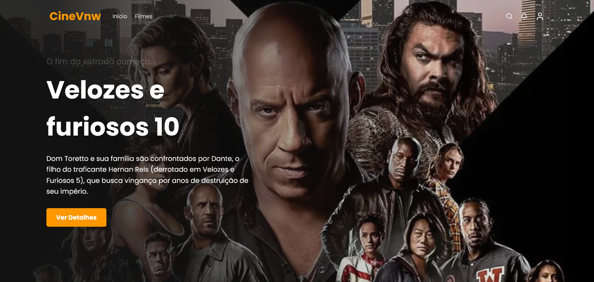

# 🍿 CineVnw

## 🌟 Introdução

O **CineVnw** é uma aplicação web moderna e responsiva desenvolvida para ser sua principal plataforma de descoberta de filmes. Utilizando a vasta base de dados da The Movie Database (TMDB), o projeto oferece uma interface intuitiva para que os usuários possam explorar, pesquisar e visualizar informações detalhadas sobre os filmes mais populares, em alta e futuros.

O objetivo é proporcionar uma experiência fluida e agradável, facilitando a escolha do seu próximo filme para assistir.

## 🛠️ Ferramentas e Tecnologias Utilizadas

O projeto foi construído utilizando um stack de tecnologias moderno para garantir alta performance, escalabilidade e uma excelente experiência de desenvolvimento e usuário:

- React
- Vite
- JavaScript
- SCSS
- ESLint
- Lucide React
- Swiper
- The Movie Database (TMDB) (API)
- Vercel

## ✨ Funcionalidades

O CineVnw oferece as seguintes funcionalidades principais:

- **Página Inicial Dinâmica**: Exibe listas atualizadas de filmes populares e em alta (Trending).
- **Design Responsivo**: Layout totalmente adaptável a qualquer tamanho de tela (desktop, tablet e mobile).
- **Navegação Rápida**: Transições de página otimizadas pela natureza do React e Vite.

## 🚀 Funcionalidades Futuras

Abaixo estão algumas melhorias e funcionalidades planejadas para o futuro do projeto:

- **Pesquisa de Filmes**: Funcionalidade de busca eficiente para encontrar qualquer filme na base de dados do TMDB.
- **Detalhes do Filme**: Ao clicar em um filme, o usuário acessa a página de detalhes com sinopse completa, elenco, nota, data de lançamento e sugestões relacionadas.
- **Navegação Rápida**: Transições de página otimizadas pelo React para uma navegação instantânea.
- **Sistema de Favoritos**: Implementação de autenticação e possibilidade de salvar filmes favoritos.
- **Listas Personalizadas**: Criação de listas de "Quero Assistir" ou "Já Vi".
- **Filtros Avançados**: Opções para filtrar filmes por gênero, ano de lançamento ou popularidade.
- **Tema Escuro (Dark Mode)**: Alternância entre temas claro e escuro para maior conforto visual.

## 🖼️ Captura de Tela e Links

Visualize o projeto em ação e acesse o código-fonte:

- [🔗 Deploy](https://cinevnw.vercel.app/)
- [🔗 Repositório](https://github.com/tatyanepgoncalves/cinevnw)


## ⚙️ Como Usar

### 🌐 Utilização Web

A maneira mais fácil de usar o CineVnw é acessando o link de deploy:

1. Acesse [🔗 CineVnw](https://cinevnw.vercel.app)
2. Comece a navegar pelas listas ou use a barra de pesquisa para encontrar um filme específico.

### 💻 Uso Local (Ambiente de Desenvolvimento)

Para rodar o projeto em sua máquina local, siga os passos abaixo:

Pré-requisitos:

- Node.js (versão 18+)
- Gerenciador de pacotes (npm ou yarn)
- Chave de API do TMDB

#### Passos:

1. Clone o repositório:

```bash
  git clone https://github.com/tatyanepgoncalves/cinevnw.git
  cd cinevnw
```

2. Instale as dependências:

````bash
  npm install
  # ou
  yarn install
  # ou
  pnpm install
````

3. Configure o arquivo de ambiente:
Crie um arquivo chamado .env.local na raiz do projeto e adicione sua chave de API do TMDB (é necessário se cadastrar no site do TMDB para obter uma):

# Exemplo de .env.local

NEXT_PUBLIC_TMDB_API_KEY="SUA_CHAVE_AQUI"

Inicie o servidor de desenvolvimento:

npm run dev

# ou

yarn dev

Acesse a aplicação:
Abra seu navegador e navegue para <http://localhost:3000>.

## 🙏 Agradecimentos

Um agradecimento especial à [The Movie Database (TMDB)](https://www.themoviedb.org/) por fornecer a API robusta e gratuita que alimenta este projeto com dados de filmes.

### 🤝 Contribuição

Contribuições são sempre bem-vindas! Se você deseja colaborar com o projeto, siga o fluxo de trabalho padrão do GitHub:

1. Faça um Fork do projeto.
2. Crie uma branch para sua funcionalidade (``git checkout -b feature/sua-feature-incrivel``).
3. Faça o commit das suas alterações (``git commit -m 'feat: Adiciona funcionalidade X'``).
4. Faça o push para a branch (``git push origin feature/sua-feature-incrivel``).
5. Abra um Pull Request.

## ✍️ Autor

Este projeto foi desenvolvido por:

- **Tatyane Gonçalves** - [GitHub](https://github.com/tatyanepgoncalves) | [Linkedin](https://www.linkedin.com/in/tatyanegoncalves/)
